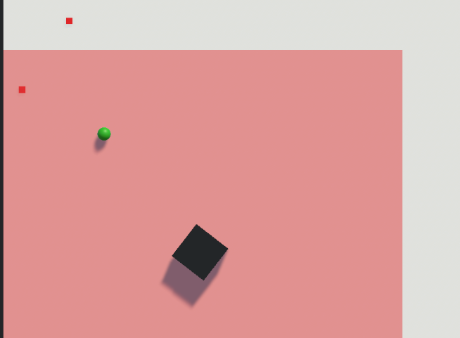
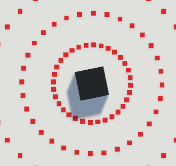
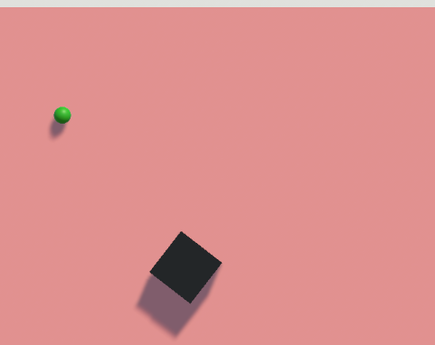
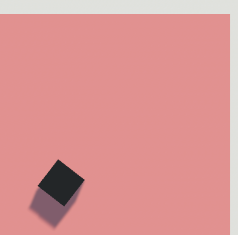

# Dream Of Circle

보스의 공격을 **예측 → 회피 → 반격**하는 핵심 반복에 집중한 Unity 2D 보스전 액션 게임입니다.

[Windows 제출 빌드 다운로드](https://github.com/yongbeom-kim-spacewhale/dream-of-circle/releases/tag/v1.0-submission)

## 프로젝트 정보

- 기간: 2026.01.31, 1일
- 형태: 크래프톤 정글 게임랩 입학시험 개인 과제
- 역할: 기획, 설계, Unity 구현, 테스트와 Windows 빌드 전 과정
- 기술: Unity, C#

## 구현 기능

- 플레이어 이동, 일반·강공격, 스태미나 기반 대시
- 플레이어·보스 체력과 피격 처리
- 원형 탄막, 다중 발사, 돌진과 범위 폭발 패턴
- 공격 전 색상·영역 경고 표시
- HUD, 승리·패배 판정과 재시작

## 주요 코드

- `Assets/Scripts/Player`: 이동, 대시, 공격, 체력과 투사체
- `Assets/Scripts/Boss`: 보스 상태와 패턴 제어, 접촉 피해
- `Assets/Scripts/Boss/murderer0107_Pattern_SquareMultiShot.cs`: 다중 탄막 패턴
- `Assets/Scripts/Boss/murderer0107_Pattern_SquareDash.cs`: 돌진 패턴
- `Assets/Scripts/Boss/murderer0107_Pattern_SquareExplosion.cs`: 경고 후 범위 폭발
- `Assets/Scenes/BattleMap.unity`: 제출 당시 전투 장면
- `release/DreamOfCircle.unitypackage`: 보존된 제출용 UnityPackage

## 플레이 화면

| 전투 | 패턴 | 결과 화면 |
|---|---|---|
|  |  |  |

## 범위 결정

하루 안에 실행 가능한 결과물을 만들기 위해 콘텐츠를 단일 보스전으로 제한하고 핵심 전투 기능부터 구현했습니다. 흔한 생존형 구조 대신 짧고 명확한 보스전 경험을 선택했습니다.

## 결과와 한계

기획부터 Windows 실행 빌드와 설명 자료까지 하루 안에 완성해 입학시험에 합격했습니다. 시작 메뉴와 ESC 일시정지 화면 등 UI·UX는 충분히 다듬지 못했습니다.

현재 저장소는 보존된 UnityPackage에서 복구한 주요 C# 스크립트, 장면·프리팹과 실제 플레이 화면을 공개합니다. 원본 Unity 프로젝트 전체가 남아 있지 않아 패키지 의존성까지 포함한 재빌드는 보장하지 않습니다. 제출 당시 Windows 빌드는 GitHub Release에서 제공합니다.
